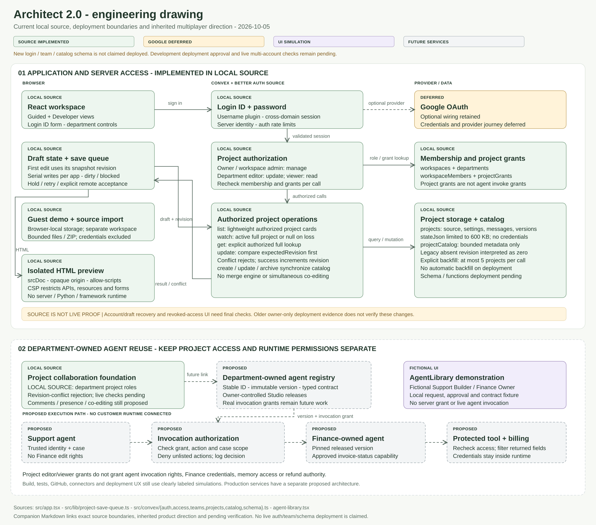
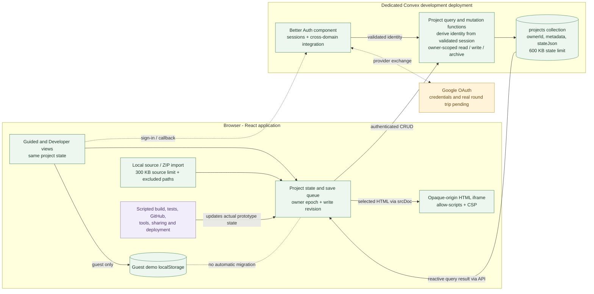
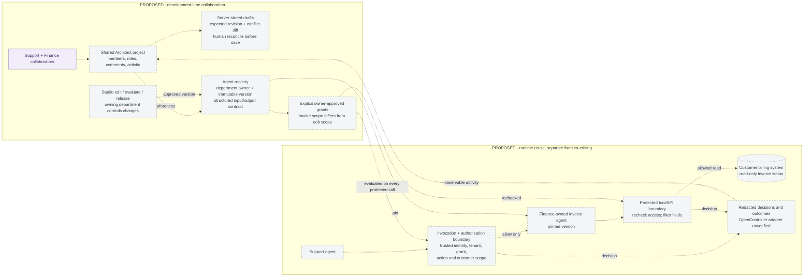

# Architect 2.0 engineering drawing

Snapshot: 2026-10-05. This records the current assignment prototype and the previously discussed multiplayer direction. It is not a new blueprint or a claim of production readiness. The user explicitly skipped blueprint; simulated feature flows are permitted by the assignment.

[Open the full-size vector drawing](arch-engineering-drawing.svg).

## How to read the drawing

| Status | Meaning |
|---|---|
| Implemented | Present in inspected source. Live verification is separately identified below. |
| Credentials pending | Google/Better Auth integration exists, but the real Google round trip and browser-to-cloud persistence have not been completed. |
| Simulated | The UI saves and displays a demonstration outcome; no model, GitHub write, external tool, invitation or public deployment runs. |
| Proposed multiplayer | Inherited product direction and a proposed engineering path. No shared-membership backend, simultaneous editing, permissioned agent reuse or customer runtime is implemented. |

## Current application architecture

The frontend starts with browser-local demo projects. Once a validated user is available, it switches to that user's Convex projects. Demo data is not automatically uploaded to a new account. The current UI separates the demo and cloud workspaces rather than implementing a general migration service. [Client state and authentication handoff](../src/app.tsx), [provider](../src/lib/backend-provider.tsx).

`projects.create` derives `ownerId` from the authenticated server context; clients cannot choose it. `list` filters by the owner. `get`, `update` and `archive` check the same owner and hide absent, foreign and archived records behind the same error. `stateJson` contains messages, source files, agent settings, versions and simulated activity—not credentials. [Backend operations](../src/convex/projects.ts), [schema](../src/convex/schema.ts).

The client queue prevents earlier acknowledgements from clearing newer unsaved edits in the same browser view. Owner-epoch checks prevent queued work from being attached to a later authentication session. These protections are **not** a distributed editing protocol: the backend currently patches one document without an expected-revision comparison, merge engine, project-membership table or collaborator roles. [Client save queue](../src/app.tsx), [backend update](../src/convex/projects.ts).

The iframe uses `sandbox="allow-scripts"` without `allow-same-origin`; supplied HTML is parsed before a restrictive CSP is inserted. This isolates host-origin cookies/storage and restricts resource loading, network APIs and forms. It is not a server sandbox, framework runner or complete network-isolation boundary: a script may still navigate its own frame. The prototype previews HTML; React/Python/server processes are not executed. [Preview implementation](../src/components/workspace.tsx).

The backend setup guide records a deployed **development** backend, anonymous-access rejection and an empty live session endpoint with the configured CORS origin. In-memory tests cover owner access, expiry and persistence. Google readiness was false because client credentials were absent; a real provider round trip, reload, sign-out and second-account isolation remain pending. No production deployment is claimed. [Setup and verification record](guide-backend-setup.md), [backend tests](../tests/backend-projects.test.ts).

## Multiplayer direction inherited from prior work

The earlier deck brief records Rishi's explicit decisions: a shared Architect–Studio workspace; **each department owns its own agents**, while other teams reuse them through permissions in a structured schema; Support–Finance as the running example; and a small customer pilot as the proposed next step. These are accepted product-direction choices, not evidence of a built service or an approved production schema. Deck brief: Confirmed decisions, Ownership decision and Running-example decision (historical local source: `Research_Data/multiplayer-agent-deck/deck-brief.md`; outside this repository), deck plan (historical local source: `Research_Data/multiplayer-agent-deck/deck-plan.md`; outside this repository).

The subsequent architecture explicitly marks itself **proposed**. Its shared-workspace section calls for server-stored drafts, comments and conflicting-save rejection; character-by-character co-editing is deferred. Its registry/grant/role details, concrete fields, OpenController adapter and customer runtime remain engineering proposals. Prior architecture: sections 1, 4, 5, 7 and 8 (historical local source: `architecture.md`; outside this repository). A separate GitHub-submission copy (historical local source: `github-submission/architecture.md`; outside this repository) also states proposed status; it was inspected as a second artifact, not assumed to be byte-identical.

The current [Agent library component](../src/components/agent-library.tsx) implements a **UI simulation** of that direction: switch between fictional Support Builder and Finance Owner, inspect a versioned contract, request access, approve/deny it, and validate sample JSON before returning a fixed fixture. Role and request state remain in the browser's `architect-2-library-simulation-v1` storage. Reuse sends the selected owner, version, capability and contract into a new project's prompt; it is not a live shared-agent reference or an enforced cross-user grant. A signed-in user may save that resulting prototype project through the ordinary owner-only Convex path. This is separate from real membership, simultaneous editing or a shared registry.

**Technical:** Being a project member, editing an agent and invoking an agent are separate permissions. A proposed Support member could invoke Finance's released invoice-status action for an authorized case without acquiring Finance edit rights, credentials, memory or refund authority. Server-enforced grants and protected tools decide access; an LLM's approval text cannot grant it.

**ELI10:** Support can ask Finance's specialist an allowed question. It cannot rewrite that specialist's rules or open Finance's whole filing cabinet.

For this assignment, a truthful multiplayer prototype can show collaborator presence samples, department ownership, a permission request, a version comparison/conflict, and a Support–Finance run with allow/deny outcomes. Each remains labeled simulated until backed by real membership, authorization and runtime behavior. Do not silently turn the current single-owner Convex project table into evidence that collaboration already works.

## Current versus future state

| Boundary | Current source | Proposed extension |
|---|---|---|
| Workspace access | One authenticated owner per Convex project | Project membership and role checks on every shared read/write |
| Editing | Local state, same-view save queue, file checkpoints | Server revision comparison, conflict diff/reconcile, comments; later optional simultaneous editing |
| Agent ownership | Editable per-project sample agent list | Stable agent identity, department owner, maintainers, releases and contract references |
| Reuse permissions | Browser-local Support/Finance role switch, version-specific request/approve/deny, input validation and fixed fixture; connector scopes and sharing preferences also simulated | Separately approved invocation grants with action, resource, fields, expiry and revocation |
| Execution | Scripted browser build/test/tool/deploy outcomes | Tested runtime adapters, invocation/tool gates and customer-owned credentials |
| Activity | Local/project messages and demonstration traces | Separate collaboration events and runtime audit events; no hidden chain-of-thought |
| Studio/OpenController | Concept links and inherited proposed responsibilities | Vendor-supported shared identity and adapter contracts, still to be validated |

The next architectural proof after the permitted UI simulation is one shared project with two real users, different roles, a deliberately conflicting edit and a rejected unauthorized write. Runtime agent reuse is a separate proof. Neither is required to pretend this assignment prototype is a production platform.
