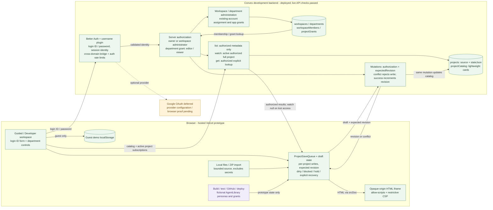
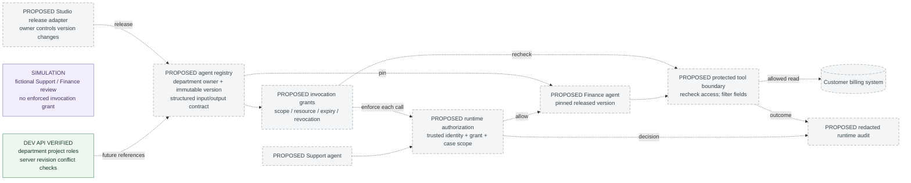

# Architect 2.0 engineering drawing

Snapshot: 2026-10-06. The approved prototype is published at the canonical origin [architect-2-weld.vercel.app](https://architect-2-weld.vercel.app), with its [public source repository](https://github.com/rishimunikesarwani-hub/architect-2). The hosted frontend uses the same development backend. **The approved auth/department/catalog schema and functions were deployed to `dev:perceptive-ermine-27` on October 5 at 22:44 IST. All 15 live API smoke checks passed using normal Better Auth HTTP requests and independent Convex clients.** Separate hosted Chrome/Edge checks now verify session reload, shared edits, conflict preservation/discard, viewer controls, live revocation/restoration and sign-out/re-entry. [Hosted acceptance record](../evals/2026-10-06-hosted-department-acceptance.md). Google setup is deferred. This drawing records that published prototype and the previously discussed multiplayer direction, not a production-readiness claim; the assignment permits simulated feature flows.

[Open the full-size vector drawing](arch-engineering-drawing.svg) | [PNG](arch-engineering-drawing.png). The separate [production architecture](arch-production-architecture.md) describes the proposed hosted runtime.

## How to read the drawing

| Status | Meaning |
|---|---|
| Hosted prototype and development evidence | The Vercel frontend and source repository are public; the approved development backend has 15 passing live API checks. Hosted Chrome/Edge acceptance verifies the scoped account, shared-edit and permission journeys below; production readiness is not established. |
| Deferred Google | Optional provider wiring remains; credentials and a Google round trip are not part of the completed verification. |
| Simulated | A UI demonstration updates prototype state. No live model, GitHub write, external tool, email invitation or app deployment runs. |
| Proposed | Agent registry, runtime invocation grants, protected execution, comments and simultaneous co-editing remain future work. |

The development deployment replaces the earlier owner-only snapshot. `catalog.backfillLegacy` returned `done: true, migrated: 0`; readiness returned password true and Google false. The earlier localhost frontend displayed the ready state; the current canonical frontend is [the hosted prototype](https://architect-2-weld.vercel.app). Independent Chrome owner and Edge department-member sessions passed the hosted acceptance checks on October 6. [Live backend smoke report](../evals/2026-10-05-department-backend-smoke.json), [hosted UI acceptance](../evals/2026-10-06-hosted-department-acceptance.md).

## Current application architecture

The frontend keeps guest demo data separate from authenticated projects; it does not automatically upload guest projects. Login ID/password forms use Better Auth's username plugin and the existing Convex session integration. Account identity comes from the server session, not a caller-supplied owner, department or role. Google remains optional and deferred. Email verification and password-reset delivery are not configured. Readiness reports configuration presence, not a successful live sign-in. [Client bridge and project handoff](../src/app.tsx), [login form](../src/components/department-auth.tsx), [auth configuration](../src/convex/auth.ts), [auth client](../src/lib/auth-client.ts).

### Project permissions and data boundaries

`projectAccessFor` grants owner access to the project owner or its workspace administrator. Other workspace members need a matching grant for their department in the same workspace: viewer can read; editor can update. Management requires owner/admin access. An email address, self-declared role or LLM response cannot confer rights. Membership changes and grant revocation are checked by reactive queries and each mutation. [Authorization helper](../src/convex/access.ts), [department mutations](../src/convex/teams.ts), [department UI](../src/components/department-access.tsx).

The metadata catalog contains title, bounded description, framework, stage, revision and presentation/count fields, but no complete `stateJson`. `projects.list` returns authorized card metadata. `projects.watch` returns the active authorized full project or null when it is unavailable/unauthorized, so revocation need not throw through the render tree. `get` remains an explicit authorized full lookup. Full project documents contain source files, messages, settings, sample agents and checkpoints, with a 600 KB state limit. These are real access/persistence mechanisms in source, not agent-execution infrastructure. [Project functions](../src/convex/projects.ts), [catalog helpers](../src/convex/catalog.ts), [schema](../src/convex/schema.ts).

Create/update/archive and workspace attachment synchronize `projectCatalog` with the full project in the same mutation. Legacy documents permit missing revision, interpreted as zero. The explicit internal `catalog.backfillLegacy` operation processes at most five legacy source documents per call; it is not auto-run at deployment. A bounded owner-only list fallback covers five legacy documents during transition. The approved development deployment completed; the explicitly run backfill reported `done: true, migrated: 0`, so no legacy documents were migrated in that run. This is not a production schema deployment.

### Saves, conflict handling and draft recovery

The backend compares `expectedRevision` before modifying a project, rejects a mismatch with `REVISION_CONFLICT`, and increments revision on success. This prevents an older full-state save from silently replacing a newer server document. Permissions are checked before the revision comparison. This is optimistic concurrency, not a merge engine or character-by-character collaboration. [Update mutation](../src/convex/projects.ts).

`ProjectSaveQueue` serializes writes per project while allowing other projects to progress. Already-dirty same-client edits chain the revisions acknowledged by successful writes. A first clean draft uses its own supplied revision, so a newer subscription arriving before the UI applies its contents cannot authorize overwriting that unseen version. Subscriptions cannot advance a dirty/blocked baseline. Failure retains dirty status, drops scheduled older snapshots and blocks that project; retry keeps the previous baseline. `hold` restores an unsaved draft without writing. `acceptRemote` installs an explicitly accepted baseline after the caller preserves/discards its local copy; `reset` invalidates callbacks from the previous account. Neither method cancels a request already sent to the server. [Queue implementation](../src/lib/project-save-queue.ts), [11 focused queue tests](../tests/project-save-queue.test.ts).

The app integrates explicit retry and preservation as a private copy. Hosted Chrome/Edge acceptance verified that an editor's save reaches the owner without a reload; the owner's conflicting typed draft stays intact with Save blocked, and explicit discard restores the remote source. Viewer controls update live, revocation closes and removes the app, and restored access is available after sign-out and normal sign-in. These observations are separate from the queue tests and API smoke. Arrival of the Download my draft file remains unverified; this acceptance does not establish every retry/private-copy branch. In-memory recovery does not survive closing or reloading a tab. [Hosted acceptance](../evals/2026-10-06-hosted-department-acceptance.md), [app integration](../src/app.tsx), [source editor](../src/components/workspace.tsx).

**Technical:** A revision is the version number of the shared project document. An editor saves against the version they actually edited; if another user saved first, the server rejects the stale write and the draft needs recovery/review.

**ELI10:** Two people can open the same page. The second person cannot quietly erase the first person's newer work by saving an old copy.

### Preview and verification boundary

The iframe uses `sandbox="allow-scripts"` without `allow-same-origin`; supplied HTML is parsed before a restrictive CSP is inserted. This isolates host cookies/storage and restricts resource loading, network APIs and forms. It is not a server sandbox, framework runner or complete network-isolation boundary: a script may still navigate its own frame. React/Python/server processes are not executed. [Preview implementation](../src/components/workspace.tsx).

Backend access/auth unit tests exercise local in-memory behavior; the focused queue suite previously passed 11 tests. Separate live evidence now records **15/15 smoke checks** against `dev:perceptive-ermine-27`: four synthetic accounts completed normal signup and login-ID sign-in; independent department clients read the same app ID/source; an editor's save propagated; viewer writes/grants and outsider/anonymous access were denied; stale revisions were rejected without overwriting source; revocation removed editor access; an incorrect password was rejected; normal logout invalidated the owner session even with its prior JWT; synthetic sessions were closed. The labeled QA accounts/workspace/app were retained. [Live smoke results](../evals/2026-10-05-department-backend-smoke.json), [backend tests](../tests/backend-teams.test.ts), [auth tests](../tests/backend-auth.test.ts).

The API smoke uses Better Auth HTTP and independent Convex clients. Separate **hosted Chrome/Edge UI acceptance** now covers owner/member session reload; an editor save reaching the owner without reload; preservation of an owner's conflicting typed source with Save blocked, followed by explicit discard to the remote source; a live change to Finance Viewer disabling editing, access management, GitHub and deployment controls; revocation closing and removing the app; restoration to Support Editor; and Edge logout/reload to guest followed by normal sign-in returning the shared app. [Hosted acceptance record](../evals/2026-10-06-hosted-department-acceptance.md).

Browser signup was performed by the user and was not observed. Source import retry remains pending Chrome file-access permission, and Download my draft file arrival remains unverified. Those limits do not invalidate the narrower passed account, shared-edit and permission checks. Google remains deferred, and no proposed production execution infrastructure was deployed for these checks.

## Multiplayer direction inherited from prior work

The earlier deck brief records Rishi's decisions: a shared Architect-Studio workspace; **each department owns its own agents**, while other teams reuse them through permissions in a structured schema; Support-Finance as the running example; and a small customer pilot as the proposed next step. Historical sources outside this repository: `Research_Data/multiplayer-agent-deck/deck-brief.md` (Confirmed decisions, Ownership decision, Running-example decision) and `deck-plan.md`. These are product-direction choices, not evidence of a deployed registry or an approved production schema.

The inherited `architecture.md` and `github-submission/architecture.md` explicitly describe proposed services: server drafts, comments, conflicting-save rejection, a department-owned agent registry, invocation grants, Studio/OpenController adapters and customer runtime. The current source now implements project membership/department grants and revision rejection; the registry and execution services remain proposed. A project editing grant is not an agent invocation grant.

The [Agent library component](../src/components/agent-library.tsx) remains a **fictional UI simulation**: Support Builder and Finance Owner are browser personas, request/approval state is in `architect-2-library-simulation-v1`, sample JSON validation returns a fixed fixture, and reuse creates a project from the selected contract/prompt. Its approvals do not write `projectGrants`, create real membership, authorize runtime access or connect a live Finance agent. A signed-in account may save the resulting prototype project through ordinary project persistence.

**Technical:** Project membership, editing an agent's definition and invoking its released capability are different permissions. The new project roles do not implement the proposed runtime authorization.

**ELI10:** Giving Support permission to edit a project does not give it Finance's account keys or permission to issue refunds.

## Current versus future state

| Boundary | Current implementation and evidence | Still proposed or pending |
|---|---|---|
| Authentication | Deployed Better Auth login ID/password; live API sign-in/denial/logout checks plus hosted Chrome/Edge session reload and Edge logout/reload/re-entry passed | Browser signup was user-performed, not observed; Google deferred; email/reset delivery absent |
| Project access | Live API owner/editor/viewer/outsider enforcement; hosted viewer controls, revocation closure/removal and Support Editor restoration passed | Exhaustive account/permission combinations and production runtime authorization remain separate validation |
| Data loading | Deployed catalog/full-project watch; shared app source, reactive updates, access removal and restored shared-app entry verified in hosted sessions; zero-document backfill completed | Broader loading/network failure and recovery scenarios |
| Editing | Live API stale rejection plus hosted editor propagation, preserved conflicting draft/blocked Save and explicit discard to remote source passed | Download my draft file arrival unverified; all retry/private-copy branches not established; conflict diff/merge, comments and simultaneous editing remain proposed |
| Agent ownership | Per-project sample agents; fictional AgentLibrary department personas | Stable registry identities, owning maintainers, releases and contract references |
| Agent reuse | Browser-local request/approve/deny, contract fixture and project creation | Real invocation grants with action/resource/field/expiry/revocation scope |
| Execution | Scripted browser build/test/tool/deploy outcomes and isolated HTML preview | Runtime adapters, protected execution and customer-owned credentials |
| Activity and Studio | Project messages and in-app same-agent editing simulation | Shared comments/presence, separate runtime audit and validated external Studio/OpenController adapters |

The remaining scoped UI checks are source import retry after Chrome file-access permission and confirmation that Download my draft reaches disk. The [hosted acceptance record](../evals/2026-10-06-hosted-department-acceptance.md) bounds the passed account, edit and access journeys. Runtime agent reuse remains a separate proposed system; it is not made real by department project grants or passing API/UI checks.
