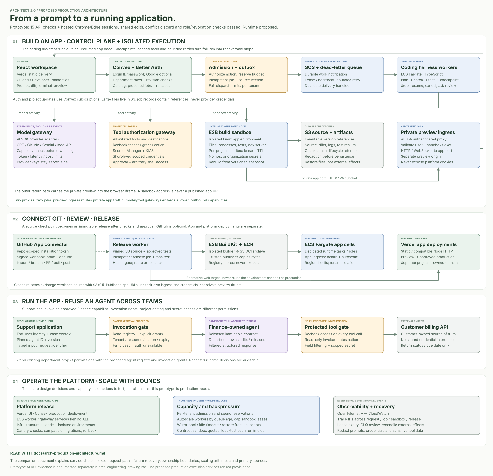
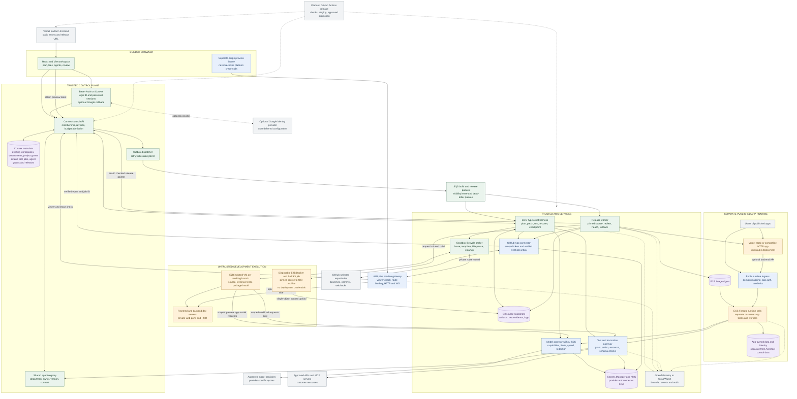
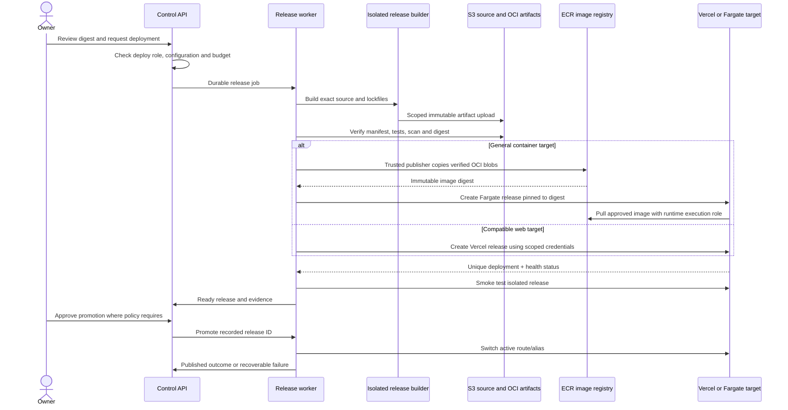

# Architect 2.0: proposed production architecture

Decision date: 2026-10-05. **This is a researched production proposal; the production execution infrastructure below is not deployed.** It extends the actual React/Vite, Convex and Better Auth prototype without claiming that its simulated builds, integrations, agent reuse or releases execute in production. The user chose login ID/password and deferred Google. The approved auth/department/catalog schema and functions were deployed to `dev:perceptive-ermine-27` on October 5 at 22:44 IST; 15/15 live backend smoke checks passed. Authenticated cross-browser UI acceptance remains pending. The [current implementation drawing](arch-engineering-drawing.md) remains the authoritative map of that boundary. The user explicitly skipped the blueprint interview; this document answers the assignment's architecture deliverable.



[Open the full-size vector drawing](arch-production-architecture.svg) or [PNG rendering](arch-production-architecture.png). The Mermaid definitions below are the editable service/sequence reference.

The full [hiring specification](https://hiring.lyzrarchitect.space/) was rendered and read by the main agent in Chrome on 2026-10-05 after the text reader failed. In addition to the supplied Build screenshot, it asks for sandbox selection, the agent harness, model switching, frontend/backend/sandbox/live-preview communication, proxies, GitHub, deployment of both user apps and the platform, and thousands of concurrent builders/runtime users. It requests a detailed service diagram and a Markdown explanation. Its Ship section requires the live URL, GitHub repository, diagram and Markdown in the Submit tab. **Preparing those artifacts does not authorize public deployment or form submission.** Public release still follows this project's [approval rule](../AGENTS.md); no hiring form has been submitted.

## The decision in one view

Use **Convex for the trusted control plane**, **E2B for untrusted development execution**, and **separate release targets for published apps**. Run a bounded TypeScript agent harness in ECS Fargate workers; use SQS to absorb demand and Convex to store durable job checkpoints. The browser receives progress from Convex and preview traffic through an authenticated proxy. It never receives sandbox-controller credentials, GitHub installation tokens or provider keys.

**Technical:** The control plane stores identities, permissions, revisions, jobs and release metadata. Sandboxes execute editable code. Published runtime services execute immutable, reviewed releases. These three lifecycles have different credentials, scaling controls and failure boundaries.

**ELI10:** Architect keeps the project notebook, gives each build its own workshop, and moves an approved result to a separate shop that customers can visit. Breaking the workshop does not grant access to everyone else's notebooks or shops.

| Responsibility | Proposed selection | Why this selection; tradeoff |
|---|---|---|
| Platform browser application | Existing React/Vite bundle on Vercel | Preserves the existing client and provides an independently deployable frontend. No server-side rendering migration is necessary for this workspace. Convex documents a Vercel deployment path. [Convex hosting guide](https://docs.convex.dev/production/hosting/vercel) |
| Identity and control data | Existing Convex + Better Auth login ID/password; optional Google deferred; separate production deployment | Extend the development-deployed workspace/department permissions, project grants, revision checks and metadata catalog with durable jobs, immutable source revisions and runtime invocation grants. Live backend smoke passed 15 checks; authenticated cross-browser UI acceptance is separate and pending. Reactive state suits progress and collaboration; long builds stay outside database transactions. [Convex limits](https://docs.convex.dev/production/state/limits) |
| Durable work admission | Convex job/outbox records, Amazon SQS standard queues and dead-letter queues | Store accepted intent before dispatch; absorb bursts without starting every sandbox immediately. SQS can deliver a message more than once, so lease/checkpoint/idempotency are application responsibilities. [SQS delivery model](https://docs.aws.amazon.com/AWSSimpleQueueService/latest/SQSDeveloperGuide/standard-queues-at-least-once-delivery.html) |
| Agent harness and release workers | TypeScript services on ECS Fargate | Long-lived workers can keep SDK/stream connections, heartbeat and resume jobs; AWS manages their hosts. Trusted worker containers never execute a user's shell command locally. [Fargate execution model](https://docs.aws.amazon.com/AmazonECS/latest/developerguide/AWS_Fargate.html) |
| Editable build and preview execution | E2B managed isolated Linux VMs with versioned Node/Python templates | Supports file and command operations plus a development web server without building a VM fleet. Pause/resume controls idle cost. Vendor availability, runtime limits and contracted concurrency remain dependencies. [E2B lifecycle](https://docs.e2b.dev/sandbox), [persistence](https://docs.e2b.dev/sandbox/persistence) |
| Private preview ingress | Dedicated TypeScript HTTP/WebSocket proxy on ECS, behind an ALB and TLS | Owns viewer authorization and server-side sandbox routing. It can proxy Vite hot reload and streaming endpoints without exposing E2B traffic tokens. ALB supports WebSockets. [ALB listeners](https://docs.aws.amazon.com/elasticloadbalancing/latest/application/load-balancer-listeners.html) |
| Model routing | Internal model gateway with AI SDK provider adapters | One normalized call contract, central credentials, budgets and provider-specific capability validation. AI SDK provides a provider abstraction; semantic equivalence is still something we test. [AI SDK providers](https://ai-sdk.dev/docs/foundations/providers-and-models) |
| Tools, MCP and reused-agent calls | Separate authorization/tool gateway on ECS | Applies tenant, action, resource and consent checks before using connector credentials. A model's tool request is a request, not permission. This service and its policy are our proposed implementation, not a capability supplied automatically by the SDK. |
| Source, imports and artifacts | Private S3 buckets; immutable manifest/digest references in Convex | Keeps large file trees and logs outside the project document. Short-lived object-specific upload/download URLs avoid giving users AWS credentials. [S3 presigned URLs](https://docs.aws.amazon.com/AmazonS3/latest/userguide/using-presigned-url.html) |
| Credentials | AWS Secrets Manager + KMS for gateway/connector secrets; protected Convex environment for its own auth configuration | Restricts who can retrieve each secret and supports rotation. Secrets remain outside project source, prompts and browser state. [Secrets Manager guidance](https://docs.aws.amazon.com/secretsmanager/latest/userguide/best-practices.html) |
| GitHub | GitHub App connector, permission-scoped short-lived installation tokens, signed webhook inbox | Selectable repositories and installation permissions fit project-level access better than a broad permanent user token. [GitHub App comparison](https://docs.github.com/en/apps/oauth-apps/building-oauth-apps/differences-between-github-apps-and-oauth-apps) |
| Published static/compatible HTTP apps | Vercel deployment API, separate project/release identity for each app | A narrow adapter handles supported build output, routing, domains and deploy status. We do not assert all arbitrary code fits this target. [Vercel API](https://vercel.com/docs/rest-api), [deployment model](https://vercel.com/docs/deployments) |
| Published general-purpose services/workers | OCI image in ECR, then separate ECS Fargate runtime cells | Covers Python agents, background workers and server processes that do not fit the first target. Each customer app has its own task boundary and minimal workload identity. Registry scanning supplies one input to release review. [ECR scanning](https://docs.aws.amazon.com/AmazonECR/latest/userguide/image-scanning.html) |
| Container image build | Disposable E2B Docker/BuildKit template per release | Runs the user's Dockerfile away from trusted release credentials. Export an OCI archive; ECR stores the finished image rather than building it. [E2B Docker template](https://docs.e2b.dev/template/examples/docker), [Docker OCI exporter](https://docs.docker.com/build/exporters/oci-docker/) |
| Operational evidence | OpenTelemetry instrumentation with CloudWatch logs/metrics, redacted audit records in object storage | Correlates job, sandbox, model, tool and release events. This is a proposed observability configuration; no existing dashboard, throughput result or security certification is claimed. |

The minimum pilot can combine the harness, dispatch and release code in one trusted worker image, with separately scoped processes/roles. The diagram separates responsibilities so secrets and traffic boundaries remain clear; it does not require a different microservice for every rectangle on day one. Model and tool gateways should keep separate authorization surfaces even if initially packaged together. Preview traffic and untrusted customer runtime remain separate from the trusted worker network.

## Proposed service diagram

All boxes below are production proposals, including the production instances of services already used in development. Solid arrows show proposed data flow, not implementation status. Dashed arrows show deployment/telemetry or optional handoff. Provider and cloud account names are recommendations, not purchased capacity.



The browser also uses authorized direct S3 uploads for large imports; only metadata and a verified object digest enter the control API. A source import is quarantined and unpacked in an isolated job before it becomes a revision. The graph does not imply that a user-supplied S3 path, sandbox ID, container address or repository name is trusted.

## 1. Sandboxes: selection, isolation and lifecycle

Choose E2B for the first real coding runtime. The relevant documented foundation is an isolated Linux VM with command/filesystem operations and controllable lifecycle. E2B currently documents authenticated controller access separately from restricted public application traffic; **both** are needed. Set secure controller access, and create sandboxes with `allowPublicTraffic: false`. The gateway retains the traffic-access token rather than putting it in an iframe URL. [Controller access](https://docs.e2b.dev/sandbox/secured-access), [application-port access](https://docs.e2b.dev/network/restrict-public-access).

Each workspace branch gets a lease bound to `(tenantId, projectId, branchId, revision, sandboxId, generation)`. One admitted write job owns that branch at a time. A detached browser does not own the process; it can reconnect to the persisted job. A different project cannot attach merely by guessing a sandbox ID. A review branch gets its own sandbox or immutable snapshot rather than writing into the editor's active branch.

Templates are immutable, versioned Node/TypeScript and Python environments with pinned system tooling. The project manifest declares framework, dependency file, install/build/test commands, entrypoint, preview port and resource class. LangGraph, CrewAI, OpenAI Agents and Lyzr adapters are conveniences; a Custom adapter supplies the same manifest. Accepting arbitrary Linux code is not a promise that arbitrary libraries, GPUs, privileged containers or every agent framework work without qualification.

The lifecycle is `queued -> provisioning -> restoring -> ready -> busy -> idle -> paused -> resuming`; terminal outcomes are `failed`, `cancelled` or `retired`. Proposed defaults: 15-minute execution lease, heartbeat every 30 seconds, pause after 5 idle minutes, and force checkpoint/recreate before the vendor's continuous-runtime ceiling. An idle preview is paused only after its connections expire; the next viewer gets a visible resume state. Keep S3 source and lockfiles as the durable truth. An E2B memory snapshot is an acceleration cache, not the only recovery copy. A reaper reconciles expired leases with vendor inventory to stop orphan cost.

Network policy begins with deny-all egress and permits the controlled package mirror plus our model/tool endpoints. E2B documents domain/IP egress controls, including limitations for domains, protocols and shared endpoints. We therefore enforce exact destinations/paths and credential scopes again in the tool gateway; a hostname allowlist alone does not prove exfiltration prevention. A dependency install may run malicious scripts, so it runs inside the same untrusted sandbox, with no organization secrets. [E2B network policy](https://docs.e2b.dev/network/internet-access).

| Alternative | Reason not selected initially | Reconsider when |
|---|---|---|
| Containers on one shared Docker host | More host lifecycle/security ownership; a stock shared kernel is not the isolation policy we want for arbitrary install scripts | A dedicated security/infra team can maintain hardened tenant isolation and prove it under adversarial workloads |
| Self-managed microVM fleet | Greater control and potentially better economics at stable scale, but image, host, kernel, network, snapshot and scheduler operations become ours | Sandbox usage and data-residency requirements justify those costs |
| Fargate for every edit session | Strong task isolation is useful, but we would build interactive filesystem/terminal/snapshot and developer-preview lifecycle ourselves | Long-running immutable runtime containers; that is the selected published-runtime role |
| Browser-only execution | Attractive for restricted frontend examples, but not an arbitrary Python/backend development environment | Optional fast preview of a validated frontend-only project |

## 2. Agent harness: planning, code, tools and recovery

The harness is a state machine controlled by application code. Model calls propose plans or tool arguments; the harness validates them. It uses bounded sequential/parallel steps and feedback loops, patterns described by the [AI SDK workflow guide](https://ai-sdk.dev/docs/agents/workflows). This proposal does not depend on a single model's private conversation state.

| Stage | Persisted result and execution rule |
|---|---|
| Understand | Prompt, accepted references, project revision, framework manifest and explicit constraints; treat repository text and tool output as untrusted input |
| Plan | Structured tasks, files likely to change, tests, needed tool permissions and estimated budget; user can edit/approve before the build starts |
| Prepare | Reserve quota, acquire branch lease, restore source by digest, install pinned dependencies and report unsupported setup clearly |
| Implement | Read/search/patch through schema-validated tools; command execution only in the sandbox; record changed file hashes before/after |
| Validate | Run actual type/build/tests and bounded preview smoke checks; store exit status and evidence, not just the model's assertion |
| Repair | Classify failure, attempt a bounded patch, rerun affected checks; proposed maximum three repair attempts before user review |
| Present | Human-readable change summary, file diff, test evidence, preview and unresolved limits; no hidden chain-of-thought |
| Checkpoint | Commit source manifest and event cursor; release or hand over branch lease; an external deploy needs its own permission and release operation |

Each accepted operation has a stable `jobId`; each side effect has `operationId = jobId + step + attempt`. A worker obtains a lease transactionally and uses a monotonically increasing fencing number. Stale workers cannot publish a checkpoint or release after a newer lease is granted. Before retrying an external write, reconcile its recorded outcome with the destination. A network timeout does not prove that a GitHub push or deployment failed.

SQS visibility is extended while the worker is healthy. If the worker dies, a new worker receives the job, checks the last persisted stage, reconciles sandbox state and resumes. Duplicate messages that reference a completed or currently leased job do no new work. A poison job stops in the dead-letter queue with a visible explanation. A cancelled job revokes its lease and short-lived capabilities, stops model streams/commands where supported, checkpoints recoverable source, and pauses or retires the sandbox.

The enqueue boundary uses a transactional outbox: a Convex mutation writes both the admitted job and an outbox record; a scheduled dispatcher attempts SQS delivery and records acknowledgement. A sweeper retries unacknowledged records using the same ID. This avoids claiming an atomic transaction across Convex and AWS. Convex schedules from mutations transactionally, but scheduled actions are not automatically retried and scheduled functions do not inherit user authentication. The dispatcher must use server-validated stored authority plus a fresh permission check, not trust an arbitrary `userId` argument. [Convex scheduling semantics](https://docs.convex.dev/scheduling/scheduled-functions).

| Failure | User-visible outcome | Recovery policy |
|---|---|---|
| Provider 429 or transient outage | Waiting for provider capacity; cancel remains available | Honor retry delay, jitter, bounded retries; use only a permitted capability-compatible fallback |
| Invalid tool arguments | Step rejected with a concise validation reason | One corrected request within the step budget; never execute malformed input |
| Dependency/build failure | Actual command/exit evidence and proposed fix | Bounded repair loop; keep last good revision and preview |
| Sandbox lost | Restoring the most recent checkpoint | Recreate from source/template; disclose loss of uncheckpointed process state |
| Permission revoked | Action stopped / access removed | Recheck before next protected call; no fallback credential |
| Conflicting project revision | Newer changes need review | Reject overwrite, show diff; reconcile or create a branch |
| Budget exhausted | Paused with completed work intact | No hidden unbounded retries; new budget requires an explicit product action |

Why not put the full loop inside a Convex action? Current documented Node-action duration is finite, and long executions consume action concurrency. Keeping job metadata there is useful; keeping thousands of waiting processes there couples UI data capacity to execution load. Why not Temporal Cloud immediately? Temporal's durable workflow model is a credible alternative, especially for multi-hour workflows, timers and complex compensations. The first bounded pipeline can use the existing database plus queue/leases. That choice saves a new orchestration service **but requires us to implement and test recovery correctly**. If workflow complexity grows, move orchestration to Temporal while keeping idempotent sandbox/tool adapters. [Temporal workflow model](https://docs.temporal.io/workflows).

## 3. Model-agnostic generation and runtime

Persist a model policy, not a hard-coded provider client inside every task: `{purpose, modelAlias, permittedProviders, requiredCapabilities, maxInputTokens, maxOutputTokens, spendLimit, timeout}`. Aliases such as `planner`, `coder`, `repair` and `app-runtime` resolve at the gateway to configured provider/model versions. AI SDK normalizes provider access and supports registries/custom aliases; our gateway adds tenant budgets, routing and audit. [Custom provider mapping](https://ai-sdk.dev/docs/reference/ai-sdk-core/custom-provider).

Changing the selected model starts at a checkpoint. Reconstruct a portable transcript from user messages, public step summaries, files and tool results; do not depend on provider-private state. Validate structured-output, tool-calling, streaming, context and image requirements before allowing the switch. A model without a required capability is unavailable for that step rather than silently losing functionality. Record the actual provider/model version used for each attempt.

The builder's coding model is separate from a generated agent's runtime model and from its framework. Switching the coding assistant from provider A to B must not rewrite a user's LangGraph app into another framework. Generated runtime code calls a scoped gateway client, or the customer explicitly supplies a compatible provider adapter. Fallback never broadens permission or moves sensitive content to a provider that the tenant disallowed. Compare output validity, repair rate, latency and cost on a fixed project eval set before promoting a new default; SDK interface compatibility is not quality equivalence.

## 4. Frontend, backend, sandbox and live preview

The frontend sends edits/prompts through the control API. It subscribes to compact job events and project metadata through Convex. The worker, not the browser, controls the sandbox. File-save requests carry `expectedRevision`; an accepted production save creates the next immutable source manifest. Concurrent saves get a conflict response with both revisions. The prototype already implements expected-revision rejection, successful revision chaining in the client queue, protected dirty drafts, and an authorized metadata catalog plus active full-project subscription. Its backend changes are deployed in development; independent live clients verified editor propagation and stale-write rejection. Authenticated browser draft/recovery and subscription-transition acceptance remain pending. Durable job events, immutable object-store manifests and sandbox control remain proposed extensions. [Project functions](../src/convex/projects.ts), [catalog](../src/convex/catalog.ts), [save queue](../src/lib/project-save-queue.ts), [card reconciliation](../src/lib/project-sync.ts).

A preview ticket binds viewer, tenant, project, lease generation and allowed app port. The browser opens a per-project preview origin under a **different registrable domain** from the platform. The gateway exchanges a short-lived, single-use bootstrap ticket for an HttpOnly viewer session; the bootstrap URL is not forwarded to user code. If third-party cookie restrictions block embedding, use a deliberate top-level preview window/bootstrap fallback rather than weakening authorization.

For each new HTTP request or WebSocket upgrade, the gateway validates the viewer and live route. It forwards only to the broker's registered E2B host/port and injects E2B's traffic token server-side. It strips platform/bootstrap credentials, restricts redirects/headers, enforces request/body/connection limits, and preserves only application-scoped traffic. A sandbox-provided URL cannot turn the proxy into a general-purpose network tunnel. Authorization revocation closes tracked WebSocket sessions; long-lived connections periodically revalidate their lease.

The iframe may run scripts, but it is never hosted at the platform origin and cannot read the platform cookie or parent DOM. Apply a project-specific CSP and a narrow `postMessage` schema with origin/window checks. Allow only documented preview capabilities; popup/top-navigation privileges are off by default. Frontend hot reload uses a gateway-routed WebSocket. The app's backend dev server can be routed under the same preview origin, avoiding the need to expose a separate privileged API directly. E2B documents private public-port access and public web endpoints; this authentication/proxy policy is our proposed layer. [E2B web URLs](https://docs.e2b.dev/network/public-url).

```mermaid
sequenceDiagram
  actor Builder
  participant UI as React workspace
  participant C as Convex control API
  participant Q as SQS
  participant W as Harness worker
  participant S as E2B sandbox
  participant M as Model/tool gateways
  participant P as Preview gateway
  Builder->>UI: Submit prompt or approve saved plan
  UI->>C: Expected revision + idempotency key
  C->>C: Check membership, budget; persist job/outbox
  C-->>UI: Job accepted + event subscription
  C->>Q: Dispatcher sends stable job ID
  Q->>W: Leaseable work
  W->>C: Acquire fenced job/branch lease
  W->>S: Restore authorized source; start dev servers
  loop Bounded implementation and validation
    W->>M: Model/tool request with scoped authority
    M-->>W: Validated result / rejection
    W->>S: Apply patch, run command/test
    S-->>W: Output and exit evidence
    W->>C: Checkpoint + bounded progress events
    C-->>UI: Reactive update
  end
  UI->>C: Request preview ticket
  C-->>UI: Short-lived viewer ticket
  UI->>P: Bootstrap isolated preview
  P->>C: Validate viewer and active lease
  P->>S: Authorized app HTTP / WebSocket
  S-->>P: Rendered app and HMR stream
  P-->>UI: Isolated preview
```

## 5. Where the proxies sit

| Boundary | Traffic direction | Responsibility | Must not do |
|---|---|---|---|
| Preview ingress | Browser -> preview gateway -> E2B web port | Viewer/session/lease authorization, route binding, HTTP/WebSocket forwarding, preview limits | Expose controller port, forward platform cookies, or trust a supplied destination URL |
| Model egress | Harness/generated runtime -> model gateway -> provider | Authenticate workload, choose allowed model, validate capabilities, reserve budget, rate-limit and redact | Treat model output as permission, or give the sandbox a global provider key |
| Tool/API egress | Harness/runtime -> tool gateway -> selected API/MCP/reused agent | Validate schema, current grant, action/resource scope, external-write approval and credentials | Allow an arbitrary URL or all account scopes because the prompt asks for them |
| Published runtime ingress | App visitor -> app domain/router -> released service | App-level identity, tenant/release routing, rate limits, safe streaming | Accept an Architect project ID as proof that the visitor may access app data |

These are separate trust roles even if some trusted gateway code shares a deployment initially. Ingress checks who may look at code execution. Egress checks what that code may cause elsewhere. A preview lock alone cannot protect a customer API, and a tool policy alone cannot protect an exposed development server.

## 6. GitHub import, branch sync and recovery

Connect through a GitHub App installation tied to an authenticated Architect tenant and the selected repository IDs. Initial import requests read access; writing commits/branches or pull requests requires the relevant additional permissions and user intent. The connector mints a repository-limited installation token when needed; the app private key stays in Secrets Manager. GitHub documents token expiration and permission/repository narrowing. [Installation-token documentation](https://docs.github.com/en/apps/creating-github-apps/authenticating-with-a-github-app/generating-an-installation-access-token-for-a-github-app).

Import resolves an exact commit SHA, downloads source to quarantine storage and records provenance. Branch work records the base SHA. Pull fetches remote metadata and shows a diff; push compares the expected remote head and fails with a conflict instead of force-pushing. Use a dedicated Architect branch or a reviewed target branch. Installation tokens can authorize broader writes than one branch, so branch allowlists, checked API operations and repository protection remain part of our connector; token scope alone does not implement branch policy. Prefer server-side GitHub API operations over injecting a reusable write token into untrusted shell processes.

Webhooks verify the raw-body HMAC signature before parsing, deduplicate delivery IDs, check the installation/repository mapping and enqueue work. Process removals/revocations to disable future sync. Never use the webhook payload's user/project fields as authority. [GitHub webhook validation](https://docs.github.com/en/webhooks/using-webhooks/validating-webhook-deliveries).

GitHub remains optional for building: S3 manifests retain source if GitHub is disconnected or unavailable. A successful local checkpoint and a successful remote push are separate statuses. An ambiguous network result is reconciled against the target commit/branch before another push attempt.

## 7. Deploying user applications

Deployment is a new job pinned to the reviewed source digest, framework manifest, test evidence, runtime configuration version and target environment. The development sandbox never becomes the production server. Rebuild in a clean isolated builder; dependency hooks and Dockerfiles remain untrusted. Only scoped temporary upload access to one build artifact is allowed there; signing/promotion credentials stay with the release worker.

The selected container builder is a **fresh E2B sandbox with a versioned Docker/BuildKit template**. E2B documents Docker inside its VM; our template would pin Docker, Buildx and base-image versions instead of downloading a mutable install script for every job. Buildx uses its `docker-container` driver and OCI exporter, because the ordinary Docker driver does not support that exporter. The job runs the reviewed source/Dockerfile, emits an OCI archive and manifest, and uploads them through a short-lived URL scoped to one new S3 object. A separate trusted publisher checks object size, manifest paths, digests and policy, then copies image blobs/manifests to ECR through the registry API. It neither executes the image nor runs a Dockerfile. ECR credentials and release-signing keys never enter the source build VM. This composed build/publish path is proposed and still requires an integration test. [E2B Docker support](https://docs.e2b.dev/template/examples/docker), [OCI export behavior](https://docs.docker.com/build/exporters/oci-docker/).

The release worker validates the artifact manifest and applies the relevant target adapter:

1. **Static or supported request/response web app:** create a distinct Vercel deployment from the pinned source/output, configure only app-scoped environment references, wait for build/readiness, and smoke-test its unique deployment URL. Node HTTP support is target-specific; long processes are routed to the container option.
2. **General container/web service or long-running agent:** build an OCI image in an isolated build job, upload to a scoped ECR repository, record its immutable digest and scan result, then start an ECS task/service in a separate customer-runtime account/network cell. Use a non-root process, bounded CPU/memory, read-only filesystem where compatible, no privileged mode and no platform administration role.
3. **Promotion:** owner reviews the ready release; update the active release pointer/domain only after readiness. Preserve the previous digest/deployment for rollback. A domain check requires actual DNS ownership verification in the real product; the prototype's domain checker is only a simulation.

Fargate services do not give us a magical request-driven scale-to-zero web platform. Keep active container services at a declared minimum replica count; queue background jobs separately and pause inactive worker-only apps. Apps requiring instant HTTP wake-up should use the compatible serverless target or a separately implemented, measured cold-start router. Customer database migration is its own reviewed operation: rolling back code does not undo arbitrary data changes.

Published app identities and data are distinct from Architect's control database. A generated app can use its own Convex deployment, database or customer service through an adapter; it cannot read the platform's `projects` table. End-user authentication belongs to the app's configured identity system. The runtime gateway binds the authenticated app/user to a release and permitted resources before invoking shared agents or tools.



## 8. Deploying the Architect platform itself

The platform repository is different from every generated application repository. GitHub Actions checks the platform, builds its Vite frontend, deploys staging Convex functions/schema, and builds signed/pinned trusted worker images. Infrastructure definitions provision queues, buckets, roles, ALBs and ECS services in staging before production. CI uses short-lived workload federation where available; deployments do not obtain credentials from project files.

After staging checks, a reviewed promotion deploys the Vercel frontend and matching Convex API, then rolls trusted services with compatible event/API versions. Expand schema first, deploy consumers, migrate deliberately, and remove old fields only later. Existing build jobs carry a harness/template version so an in-flight worker can finish or resume compatibly during rollout. Login ID/password is the chosen authentication flow; isolate each environment's Better Auth configuration, trusted origins and session secrets. If Google is enabled later, configure distinct dev/staging/production OAuth callbacks and origins rather than copying a development callback into production. Google remains deferred, not a prerequisite for verifying password sign-in.

For this assignment, the concrete shipping target is much smaller: publish the existing prototype frontend with its configured backend, preserve truthful simulation labels, and expose the architecture artifacts and source repository. The proposed AWS/E2B runtime is not required to exist merely to host that prototype. Prepare the repository and reviewed release package first, then obtain approval for public deployment/publishing as required by `AGENTS.md`. Verify the live URL and repository after release; submission to the hiring form is a separate action and remains unperformed.

## 9. Thousands of builders and runtime users

These figures are **planning assumptions**, not measured throughput, SLAs or purchased quotas. Capacity follows active work, connection count, model throughput and external limits. Thousands of logged-in viewers are not thousands of simultaneously compiling sandboxes.

### A concrete initial scale target

| Assumption | Arithmetic | Capacity consequence |
|---|---|---|
| 5,000 connected builders; 12% actively building | `5,000 * 0.12 = 600` build jobs | Admit 600 active jobs; remaining requests queue fairly |
| Average active build duration 120 seconds | `600 / 120 = 5` new builds/second at steady state | Creation, model and dependency capacity must sustain the arrival rate |
| 400 additional active preview-only sessions; 100 warm sandboxes | `600 + 400 + 100 = 1,100` live sandboxes | Plan 25% headroom: `1,100 * 1.25 = 1,375`; contract about 1,500 capacity |
| Each live sandbox requests 2 vCPU and 2 GiB | `1,100 * 2 = 2,200` vCPU and GiB | This is sandbox-provider capacity/cost, separate from AWS coordinator capacity |
| Each build uses 12 model calls, averaging 2,000 input + 500 output tokens | `5 * 12 = 60` calls/sec; `60 * 2,500 * 60 = 9,000,000` tokens/min | Build budget needs roughly 3,600 requests/min and 9M tokens/min across allowed providers |
| 200 simultaneously active published apps at 2 HTTP requests/sec | `200 * 2 = 400` requests/sec | Size public runtime ingress independently from builder ingress |
| 5% of app requests start an agent job; mean run 20 seconds | `400 * 0.05 = 20` jobs/sec; `20 * 20 = 400` in-flight runtime jobs | Separate runtime queue/pool; builder demand cannot starve app users |
| Each runtime job uses 2 calls averaging 1,500 input + 300 output tokens | `20 * 2 = 40` calls/sec; `40 * 1,800 * 60 = 4,320,000` tokens/min | Combined example: 6,000 model requests/min and 13.32M tokens/min |
| Add 25% model headroom | `6,000 * 1.25 = 7,500` RPM; `13.32M * 1.25 = 16.65M` TPM | Must negotiate/check quotas per actual provider/model; one aggregate quota is not interchangeable with all model quotas |

If the mean build takes 240 seconds at the same 5/sec arrival rate, required active build slots double to 1,200. If every one of 5,000 builders starts at once, the 600-slot admission policy produces a queue; we must show that wait rather than claim instant service. Lowering latency, reducing calls and caching dependencies may help, but cannot be assumed before measurement.

### Known limits and the action they imply

E2B's current published table lists Pro concurrency spanning **100–1,100**, sandbox creation at **5/sec**, and a **24-hour** continuous runtime; Enterprise is custom. Therefore the 1,500-slot target and creation/resume bursts need an explicit capacity agreement and prewarming. The table's separate concurrent-template-build limit is not a statement that only that many user commands can run. Verify the actual project's quota before launching load. [E2B billing and limits](https://docs.e2b.dev/billing).

Convex currently lists S16 at **1,000 concurrent sessions** and S256 at **10,000**. The 5,000-builder target cannot be claimed against the default S16 deployment. S256 is a candidate, subject to load tests, bandwidth/write limits and pricing. Subscribe to bounded per-project/event windows, not every source file or all tenant jobs. [Convex deployment limits](https://docs.convex.dev/production/state/limits).

At 1,000 active build/runtime jobs with one progress batch every two seconds, the control plane receives about 500 event writes/sec. At 2 KiB/batch that is about 1 MiB/sec before indexes, retries and other writes; this is sizing arithmetic, not a guarantee of measured throughput. Token-by-token streams and large logs belong on bounded streams/object storage; coalesce UI updates. Debounce editor saves and upload changed file blobs instead of serializing an entire large repository into one Convex document.

For coordinator sizing, assume one measured worker can supervise 20 I/O-heavy jobs: 1,000 jobs would need 50 workers. At a proposed 0.5 vCPU/1 GiB each, that is 25 vCPU/50 GiB before gateways and redundancy. This ratio must be benchmarked under stream parsing and checkpoint load; it is not a vendor promise. Autoscale on admitted backlog/oldest-message age and worker utilization, with a hard cap set by sandbox/model capacity. ECS supports service scaling, but autoscaling does not remove downstream quotas. [ECS service scaling](https://docs.aws.amazon.com/AmazonECS/latest/developerguide/service-auto-scaling.html).

As a conditional container-runtime example, 200 active apps with two replicas at 0.25 vCPU/0.5 GiB consume 100 vCPU/200 GiB **in addition** to coordinator capacity. Thousands of always-on apps scale that cost linearly unless the workload fits a different target. Request sufficient Fargate vCPU, launch, networking/IP and service quotas with rollout headroom. Fargate launch throttles are separately documented; a high vCPU allowance alone does not guarantee unlimited launch rate. [Fargate throttling](https://docs.aws.amazon.com/AmazonECS/latest/developerguide/throttling.html).

Use runtime cells to bound failure: for example, no more than 50 container apps per regional ALB/cell initially, with two replicas per active app. This deliberately leaves room below the documented default 100 rules/ALB and 100 target groups/ALB; app count and routing shape remain adjustable after measurement. Do not route thousands of apps by adding unbounded rules to one ALB. Confirm domain-certificate and provider project/deployment limits too. [ALB quotas](https://docs.aws.amazon.com/elasticloadbalancing/latest/application/load-balancer-limits.html), [Vercel limits](https://vercel.com/docs/limits).

### Backpressure and failure containment

Admission atomically reserves per-tenant concurrent jobs and estimated spend. Proposed pilot policy: one writer per project branch, two active builds per paid workspace, a global 600-build ceiling, a separate runtime reservation, and a bounded queue. These are adjustable product policies, not vendor limits. A request receives `queued`, an estimate/range, and a cancel control. If the bounded queue is full, reject clearly with a retry hint rather than accepting work we cannot preserve.

Maintain separate semaphores for sandbox creation/live capacity, model RPM/TPM, tool connectors, GitHub operations and deployment targets. Back off independently on 429 responses. Use fair tenant scheduling so one organization cannot occupy the entire worker pool. Reserve capacity for cancellation, access revocation, health checks and released-app runtime. A provider outage opens its circuit breaker and pauses affected jobs; an approved alternative can be chosen only within tenant policy.

A single-region pilot is honest. Multi-AZ trusted services and vendor-managed recovery reduce component failures, but this document does not prove global active-active Convex state or zero recovery time. Regional runtime cells and copied immutable artifacts reduce blast radius; a control-plane outage makes privileged operations fail closed while already published, independently hosted static pages can continue. Define recovery targets after backups/restores and outage drills are measured.

## 10. Ownership, shared agent reuse and multiplayer

The inherited product decision is departmental ownership with permissioned reuse in a shared Architect–Studio workspace, using Support and Finance as the example. Prior confirmed direction (historical local source: `Research_Data/multiplayer-agent-deck/deck-brief.md`; outside this repository). The earlier architecture calls server drafts/conflict handling proposed and defers character-level co-editing. Prior architecture, shared-workspace and permission sections (historical local source: `architecture.md`; outside this repository). Those historical sources are not deployment evidence. The current department project-access and expected-revision code is now deployed in development, with role enforcement, revocation and stale-write denial covered by the 15-check live API smoke. Authenticated cross-browser UI acceptance remains pending. The proposed shared agent registry and runtime permissions are separate.

Production metadata extends the existing development-deployed `workspaces`, `departments`, `workspaceMembers`, `projectGrants`, `projects` and `projectCatalog` schema; it does not rebuild all membership as a new service. Add `projectRevisions`, `agentVersions`, `invocationGrants`, `jobs`, `events` and `releases` for immutable execution history and runtime capabilities. Local department grants authorize project reads/edits; management remains with the project owner or workspace administrator. None of those roles authorizes agent invocation. Agent versions are immutable releases with input/output schemas, allowed tools and department owner. Project membership, agent edit rights, release rights and invocation rights remain separate checks. Studio and Architect can become two clients of the same registry only after a supported identity/API integration is validated; the current in-app handoff is a simulation. [Existing schema](../src/convex/schema.ts), [server authorization](../src/convex/access.ts), [department operations](../src/convex/teams.ts).

Support requests Finance's `invoice.status.read` capability for an approved customer/case scope. Finance approves a pinned version and explicit fields/expiry. At runtime the invocation gateway validates trusted caller identity, tenant, current grant, version and input schema. The Finance agent's tool call is checked again at the billing API boundary; only allowed fields return. Editing prompts, selecting the fictional Finance role in the UI, or being in the same project cannot create that grant. Revocation applies to subsequent protected calls and cancels relevant long-lived sessions/jobs where possible; it cannot undo an external action already completed.

For editing, retain the expected-revision compare-and-save already implemented in local source, and add comments and a conflict diff before attempting character-level co-editing. Reuse is a versioned reference, not a copy of another team's credentials or private memory. Upgrading a reused agent shows contract changes and requires renewed compatibility/review where needed. The current AgentLibrary copies a described contract into a new owner's project; its browser personas and approvals remain fictional and separate from real project permission code. It is useful UX evidence, not this runtime system.

## 11. What is implemented and what would prove the proposal

| State | Evidence boundary |
|---|---|
| Implemented prototype source | React workspace; local demo persistence; Better Auth login ID/password; owner/workspace-admin and department editor/viewer project permissions; expected-revision saves and dirty-draft queue; metadata catalog with authorized full-project watch; source/ZIP parser; isolated HTML preview; labeled feature simulations; engineering artifacts |
| Development backend deployed and verified | Approved deployment to `dev:perceptive-ermine-27` on October 5 at 22:44 IST. Backfill returned `done: true, migrated: 0`; readiness password true, Google false. Normal Better Auth HTTP plus independent Convex clients passed 15/15 live checks: four account sign-ins, same shared app/source, editor propagation, viewer/outsider/anonymous denial, stale conflict, revocation, wrong-password rejection and logout invalidation. [Smoke report](../evals/2026-10-05-department-backend-smoke.json) |
| Browser acceptance pending | The frontend at `http://localhost:5177` showed readiness, but authenticated cross-browser create/edit/reload/sign-out, permission presentation and conflict/draft recovery acceptance remain pending. API smoke is not UI proof. Google is user-deferred and optional. |
| Simulated UX | Prompt generation, external integrations, shared-agent grants, GitHub, Studio, model execution and generated-app deployment |
| Proposed here | E2B, AWS infrastructure, model/tool/preview gateways, durable harness, real shared registry and app runtime, production deployment pipelines and scaling policies |
| Unproven until measured | Sandbox isolation tests, reconnect/recovery, token/permission revocation, GitHub duplicate delivery handling, release rollback, representative framework runs, the capacity and latency targets above |

The first real execution slice should prove one prompt -> approved plan -> isolated file patch -> actual test -> protected live preview -> immutable checkpoint. Then prove worker death/retry without duplicate external effects, a two-user denied edit/invocation, and one clean deployment/rollback. Finally load-test the stated mix and obtain quotas before raising admission. Those are production validation milestones, separate from the assignment's permitted dummy-flow UI acceptance.

The current [requirement audit](../evals/2026-10-05-requirement-audit.md) records source/UI proof per feature. This architecture document cannot substitute for either a live prototype URL or a tested runtime, and the current prototype must not be described as implementing this whole drawing.
